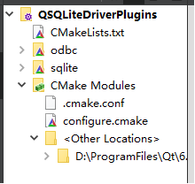
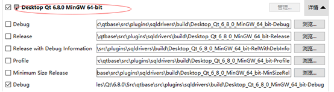
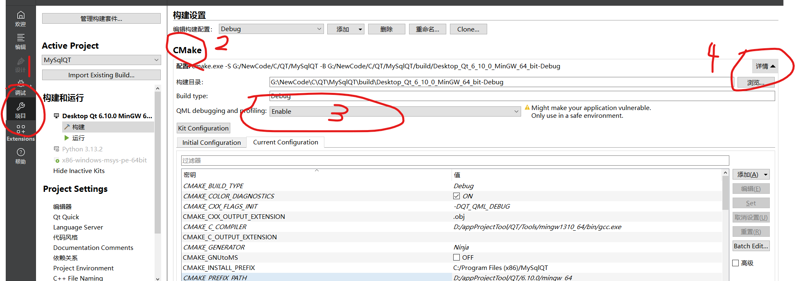
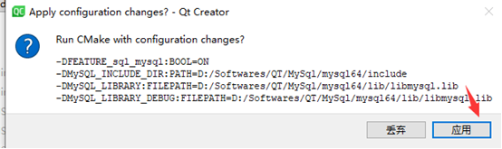
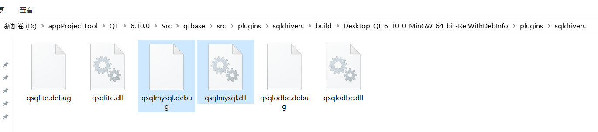

编译提示：QSqlDatabase: QMYSQL driver not loaded, 说明没有MYSQL驱动

# 第1步:下载MySQL驱动

进入到MySQL官网下载MySQL驱动，进入到[MySQL官网下载页面](https://dev.mysql.com/downloads/)，找到[MySQL Community Server](https://dev.mysql.com/downloads/mysql/)，点击Archives.

找到自己的mysql版本

# 第2步:打开数据库驱动项目

 在QT中 打开项目，选择文件为CMakeLists.txt

 QT目录\Qt\6.8.0\Src\qtbase\src\plugins\sqldrivers\CMakeLists.txt

打开完成后项目目录结果如下(没有 mysql文件夹)

默认情况下，会让你选择构建套件,我们先选择MinGW的套件

 然后，拖动滚动条到下方，点击 Configure Project

 完成后，我们在左侧切换到【项目】	选择从，cmake右侧详情展开

MySQL_INCLUDE_DIR	选择下载的mysql驱动文件夹的include文件夹

MySQL_LIBRARY  和  MySQL_LIBRARY_DEBUG	选择lib文件夹下的libmysql.lib

# 第3步:编译

点击左下角开始构建,此时会有提示

 完成后，我们再来看项目结构,己经多出来一个 mysql:

成功的情况下，项目下的以下目录，会出来编译后的dll文件

# 第4步:复制文件

我们需要复制一些文件到QT环境中才能生效.

##### 1、复制编译好的库文件

​	我们将这2个文件复制到 Qt\6.8.0\mingw_64\plugins\sqldrivers 下

**2、复制libmysql.dll到对应的bin目录下**

​	QT\MySql\mysql64\lib\libmysql.dll 复制到Qt\6.8.0\mingw_64\bin 下面(我选择的是我自己安装的mysql路径)

然后就不报没加载驱动了。

[参考原文链接，原文太糊，自己写一份记录]: https://www.cnblogs.com/bluejade/p/18562076

