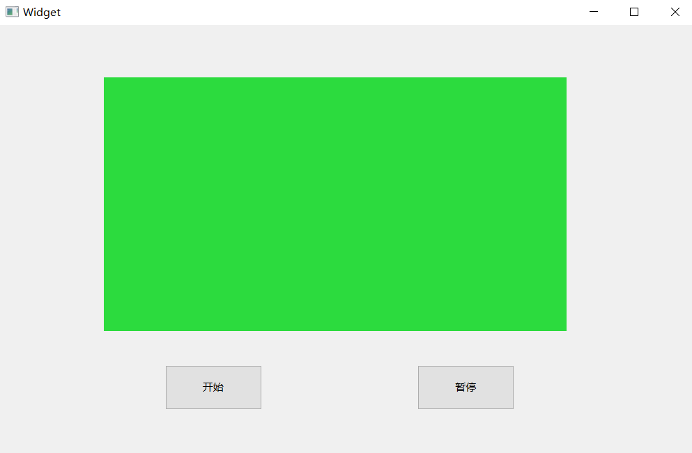
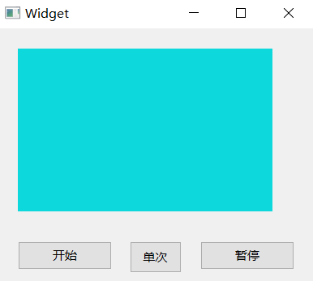
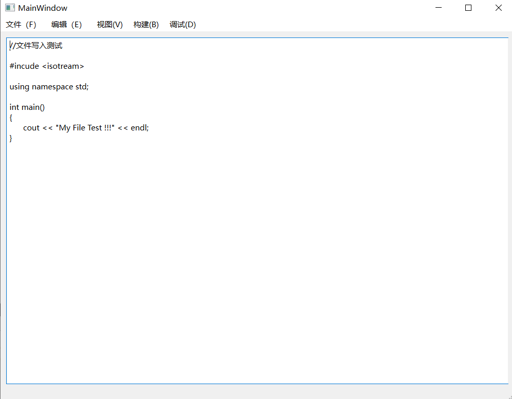
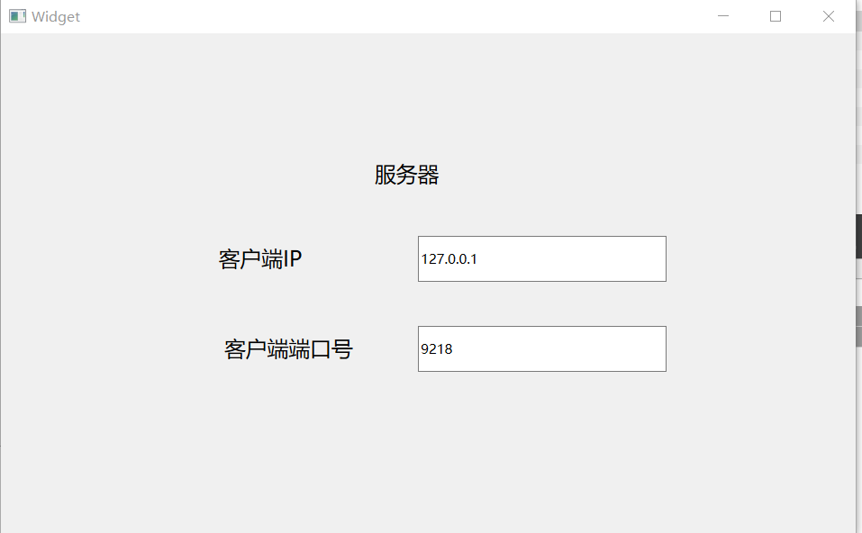
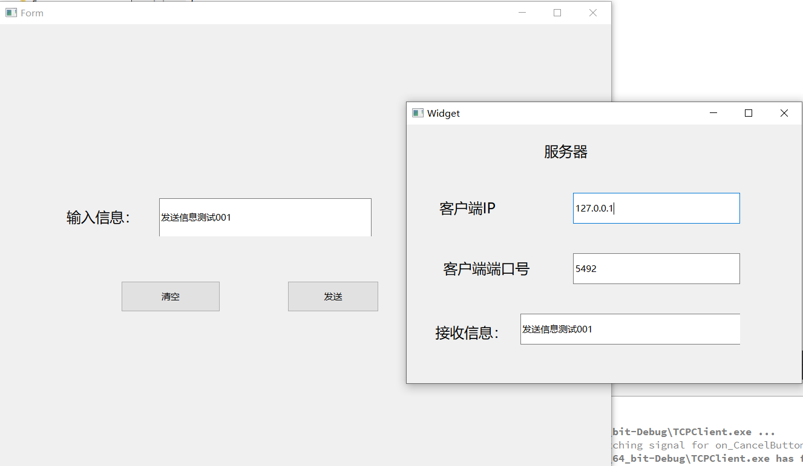

# QT_Study
QT学习


### CmdPage：cmd打开页面

编译链使用cmake

------


### Calculator：简易四则运算计算器

未进行数据校验，某些错误行为会导致程序卡死。

编译链使用cmake


------

### ObjectTimer：实现纯色图片的循环显示，1秒一次切换

定时器




------


### QT定时器的使用以及图片的第二种使用方法




------

### FileControl:文件操作

实现功能：

文件的创建、读写、存储




鼠标键盘事件监听，重写event函数，注意重写时键盘和鼠标的event函数名要大小写完全匹配，否则无法开启监听。


添加：ctrl+s文件保存快捷键；鼠标左右键监听，debug输出坐标


------

### TCPClient:

QtTCP客户端建立过程记录（cmake编译链）：

首先需要修改cmakelist.txt,添加

```
 find_package(Qt6 REQUIRED COMPONENTS Network)
 target_link_libraries(mytarget PRIVATE Qt6::Network)
```

具体可见QT客户端help搜索【Qt network】,第一页关于cmake就是这个。

其次， 【target_link_libraries(mytarget PRIVATE Qt6::Network)】中的mytarget需要替换为项目名称，否则报错，原因不明。

巧了，服务器没时间学了，明天再来！


------

### TCPServer：TCP服务端，简单通信，本地回环地址




------

### QT创建新窗口

在客户端服务器基础上实现连接后客户端在新窗口发送数据到服务器

Debug记录：

客户端发送数据后异常崩溃，debug得知类型为SIGSEVG崩溃，原因大多为访问不存在或者不正确的地方造成。

debug输出得知数据转换没问题。

原因：引用的socket对象在初始化的时候没赋值。




------

