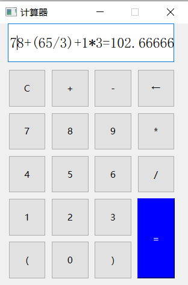

# QT_Study
QT学习


### CmdPage：cmd打开页面

编译链使用cmake

------


### Calculator：简易四则运算计算器

未进行数据校验，某些错误行为会导致程序卡死。

编译链使用cmake





------

### ObjectTimer：实现纯色图片的循环显示，1秒一次切换

定时器


------


### QT定时器的使用以及图片的第二种使用方法


------

### FileControl:文件操作

实现功能：

文件的创建、读写、存储


鼠标键盘事件监听，重写event函数，注意重写时键盘和鼠标的event函数名要大小写完全匹配，否则无法开启监听。


添加：ctrl+s文件保存快捷键；鼠标左右键监听，debug输出坐标


------

### TCPClient:

QtTCP客户端建立过程记录（cmake编译链）：

首先需要修改cmakelist.txt,添加

```
 find_package(Qt6 REQUIRED COMPONENTS Network)
 target_link_libraries(mytarget PRIVATE Qt6::Network)
```

具体可见QT客户端help搜索【Qt network】,第一页关于cmake就是这个。

其次， 【target_link_libraries(mytarget PRIVATE Qt6::Network)】中的mytarget需要替换为项目名称，否则报错，原因不明。

巧了，服务器没时间学了，明天再来！


------

